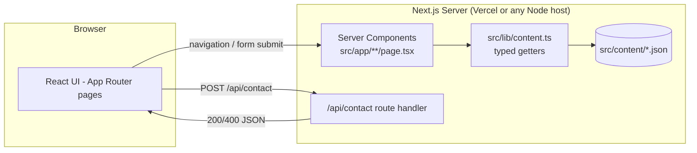
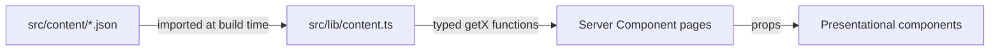
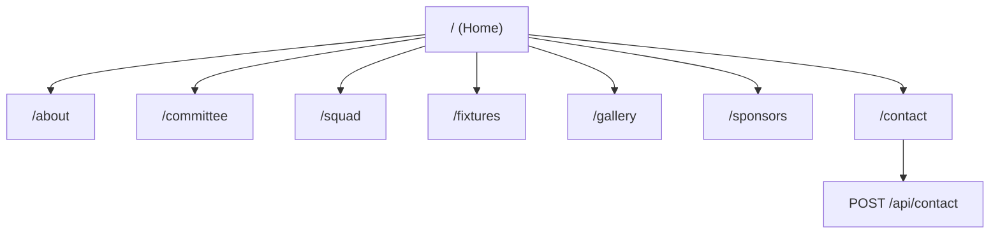
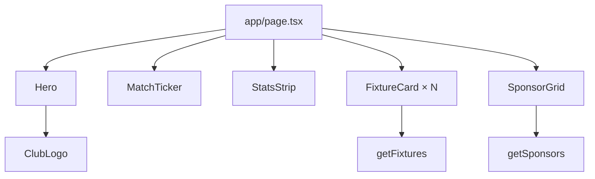

# Architecture

This document explains how the Black Panthers Cricket Club site is put together,
for anyone (human or AI agent) picking up development.

## 1. High-level overview



- Almost every page is a **React Server Component** that reads content directly via
  `src/lib/content.ts` at request/build time — no client-side data fetching for content.
- Interactive bits (squad filters, fixtures/results tabs, mobile nav, gallery lightbox,
  contact form) are small **Client Components** (`"use client"`) nested inside the
  server-rendered pages.
- The only server mutation endpoint is `POST /api/contact`, which validates input and
  (today) just logs it — see [Extending the contact form](#5-extending-the-contact-form).

## 2. Content model ("CMS-lite")

There is no external headless CMS. Content lives in versioned JSON files and is typed
end-to-end:



| JSON file | Getter | Used by |
| --- | --- | --- |
| `club.json` | `getClub()` | Home, About, Contact, Footer |
| `next-match.json` | `getNextMatch()` | `MatchTicker` (Home) |
| `committee.json` | `getCommittee()` | Committee page |
| `players.json` | `getPlayers()` | Squad page |
| `fixtures.json` | `getFixtures()` | Home, Fixtures page |
| `results.json` | `getResults()` | Fixtures page |
| `events.json` | `getEvents()` | Gallery/Events page |
| `gallery.json` | `getGallery()` | Gallery/Events page |
| `reels.json` | `getReels()` | Gallery/Events page |
| `sponsors.json` | `getSponsors()` | Home, Sponsors page |

Why this matters for future changes: **the JSON shape and the TypeScript types in
`src/lib/content.ts` must change together**. If you add a field to a JSON file, add it
to the matching type, and update [CMS-GUIDE.md](../CMS-GUIDE.md) so non-developers know
about it.

A future migration to a real headless CMS (Sanity/Prismic/etc.) would only require
swapping the bodies of the `getX()` functions for API calls — page/component code
would not need to change, since it only depends on the exported types.

## 3. Page / route map



Every route lives under [`src/app`](../src/app). `layout.tsx` wraps every page with the
`Navbar` and `Footer`; `globals.css` defines the color theme once as CSS variables
(`--panther-*`) consumed via Tailwind's `@theme inline`.

## 4. Component composition (example: Home page)



Reusable presentational components live in [`src/components`](../src/components) and
take typed props from `src/lib/content.ts` — they don't import JSON directly.

## 5. Extending the contact form

`src/app/api/contact/route.ts` validates the payload (name/email/phone/inquiryType/
message) and currently just `console.log`s it. To wire it to a real destination
(email service, CRM, spreadsheet, Slack webhook, etc.), replace the `console.log` call
— the validation and response contract (`{ ok: true }` / `{ error: string }`, matching
HTTP status codes) should stay the same so `ContactForm` doesn't need changes.

## 6. Testing architecture

```mermaid
flowchart LR
    subgraph Unit/Component - Vitest + Testing Library
        L1[src/lib/__tests__] --> Content[content.ts]
        L2[src/app/api/contact/__tests__] --> Route[route.ts]
        L3[src/components/__tests__] --> Components[Interactive components]
    end
    subgraph E2E - Playwright, runs against a production build
        E1[e2e/homepage.spec.ts]
        E2[e2e/navigation.spec.ts]
        E3[e2e/squad-and-fixtures.spec.ts]
        E4[e2e/contact-form.spec.ts]
    end
```

- **Vitest** (`vitest.config.mts`) runs in `jsdom`, with `@/*` aliased to `src/*` (matching
  `tsconfig.json`). Component tests use React Testing Library + `@testing-library/user-event`.
- **Playwright** (`playwright.config.ts`) runs `npm run build && npm run start` and drives
  a real Chromium browser against the production build — these are smoke tests for
  critical user flows, not exhaustive coverage.
- **Policy:** any new feature or bug fix should come with a new/updated test at the
  appropriate layer, and both `npm test` and `npm run test:e2e` should pass before the
  change is considered done. See [`.github/copilot-instructions.md`](../.github/copilot-instructions.md).

## 7. Theming

All colors are CSS custom properties defined once in
[`src/app/globals.css`](../src/app/globals.css) (`--panther-black`, `--panther-charcoal`,
`--panther-gold`, `--panther-gold-dark`, `--panther-crimson`, `--panther-cream`,
`--panther-muted`) and exposed to Tailwind via `@theme inline` as `bg-panther-*`,
`text-panther-*`, `border-panther-*` utilities. To re-theme the whole site, change the
hex values in one place — no component changes needed.

## 8. Known constraints / gotchas

- **lucide-react v1.x removed trademarked brand icons** (Instagram/Facebook/YouTube/etc.).
  Custom SVGs for these live in [`src/components/social-icons.tsx`](../src/components/social-icons.tsx).
- **Club logo** is expected at `public/images/logo.png` (see [CMS-GUIDE.md](../CMS-GUIDE.md)).
  It is not committed by default; components reference the path and degrade to a broken
  image if it's missing.
- **Windows/PowerShell**: `npx`/`npm` `.ps1` shims can be blocked by execution policy —
  use `npx.cmd` / `npm.cmd` if you hit `UnauthorizedAccess` errors.
